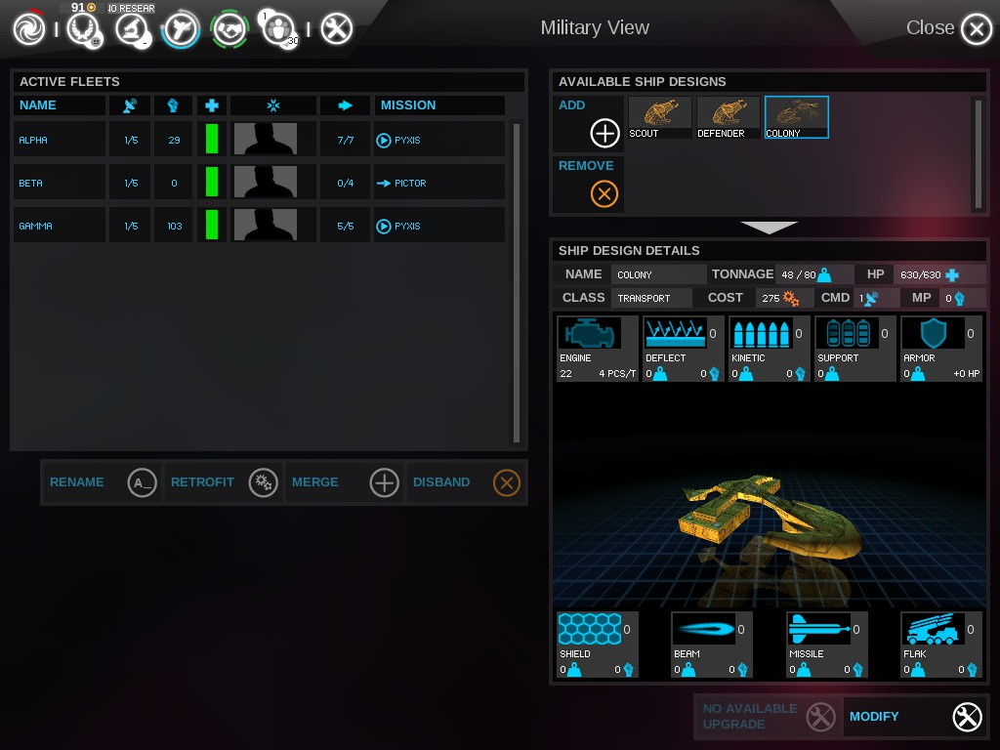

# Endless Star Trek Mod

### What dose the mod change?

- adds 9 star trek races to the game.  
  _(the Cardassian, Species 8472, the Dominion, the Borg, the Breen, the Romulan, the Federation, the Klingon and the Ferengi)_
  
- All races can be fully customized.  
  
- Every race has there own ship designs.  
  
- Star Trek Hero's.  
  

### How to install the mod?

1. Go to steam and download the game "Endless Space" for **FREE !**  
   [follow steam link for free download of "Endless Space"](https://store.steampowered.com/app/208140/ENDLESS_Space__Definitive_Edition/)
2. Download this mod from the repository.  
   
3. Create a folder "Modding" in your ...  
   **C:\Users\...\Documents\Endless Space** ... directory
4. Unzip the file into your **"Modding"** folder  
   _(C:\Users\...\Documents\Endless Space\Modding)_
5. Start "Endless Space" in steam.
6. Open the "MODS" menu from the main menu  
   
7. Double click on the "Endless Star Trek" mod and confirm the that you want to load the mod.
8. The game exits and may restart with the mod or not. If not, than just start the game as usual.
9. Back in the main menu, you should see in the bottom left corner the game and mod version.
10. This mod is for the "classic" version of the game. You can change the version on the bottom right side of the main menu if you are on the "disharmony" version.  
    

### What else could be change in the future?

- Intro videos and the soundtrack could be changed by overwriting the original files in the local directory
- Localization and flavour text could be added to the mod.
- Random events.
- Unfortunately, I was not able to change the holograms in the diplomacy menu.
